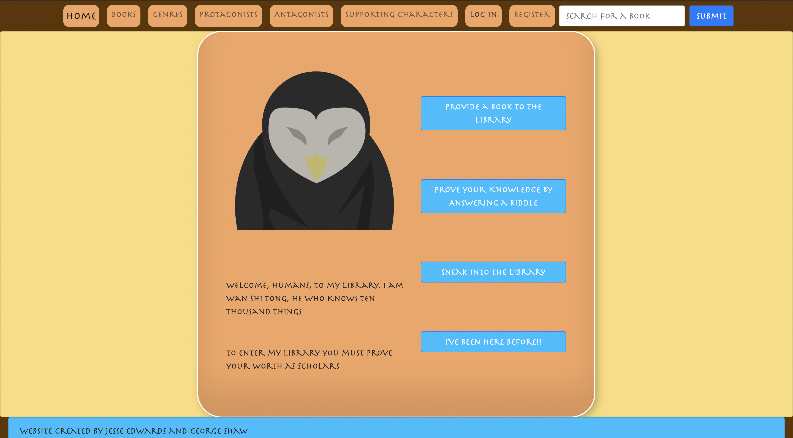
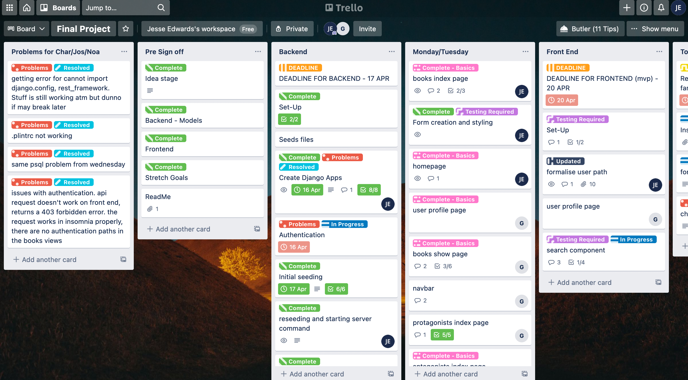
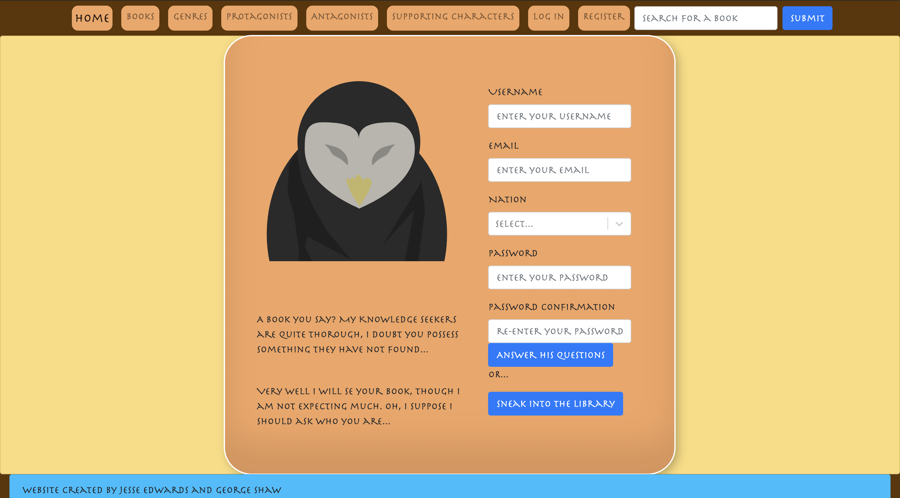
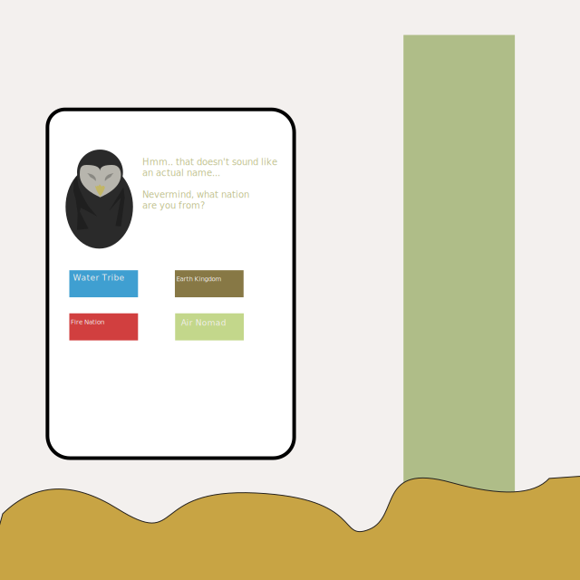
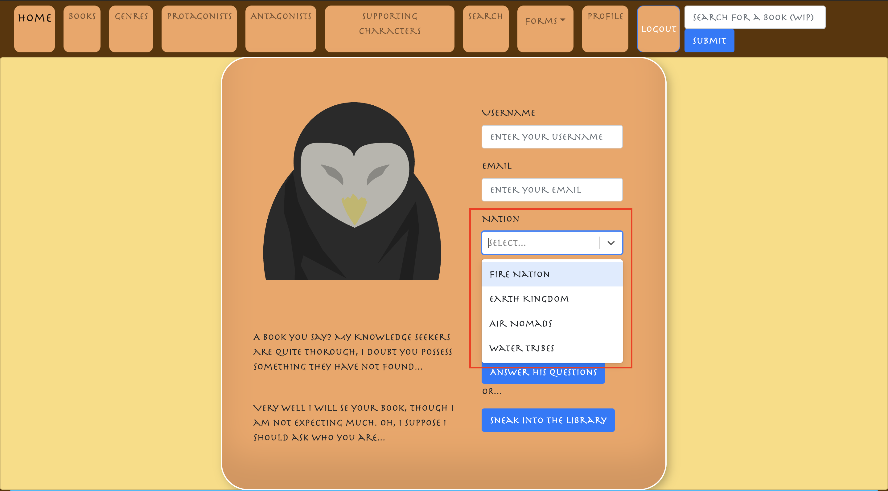
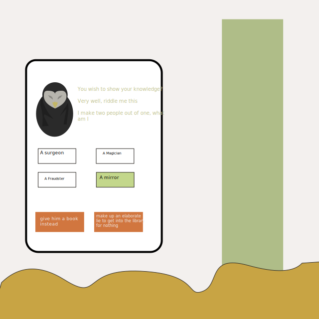
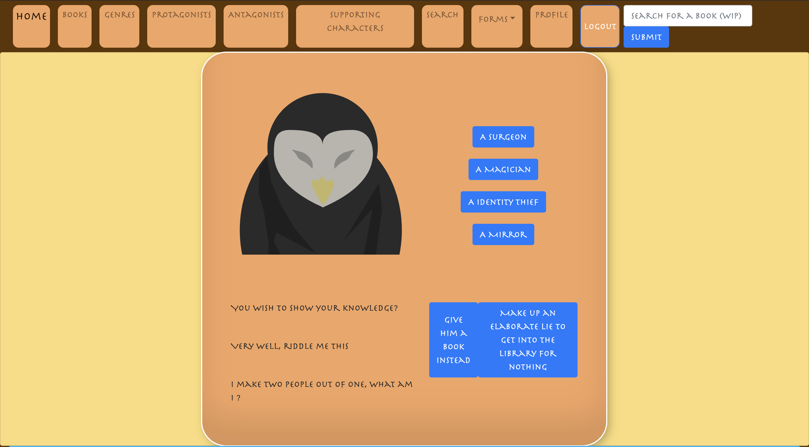
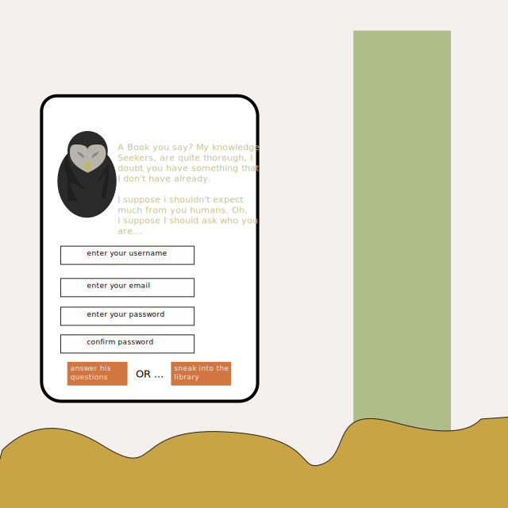

# BookFinder
> SEI Project 4 - A full stack Django App

The goal of this project was to create a full stack application. The requirements from the brief were
1) Use a Django API to serve your data from a PostgreSQL database
2) Consume your API with a separate front end built with ReactJS
3) CRUD Functionality

[](http://project-book-finder.herokuapp.com/)
><small> Click the image to link to the deployed app</small>

Team Members

George Shaw [](https://github.com/Gs742) [](https://www.linkedin.com/in/georgeshaw1998)

## Installing / Getting started
### Development

If forking/cloning the repo, a yarn and yarn start should start up the app's frontend:

```shell
$ cd client;
$ yarn; yarn start
```

For the backend, the database needs to be seeded and started:

```shell
$ cd backend;
$ pipenv run seedall; pipenv run serve
```
### Main

If working from the main branch the front and backend run on the same server:

```shell
$ pipenv run seedall; pipenv run serve
```

## Technologies/Packages Used

- Django
- JavaScript
- Python 3.9
- ReactJs
- SCSS

### Frontend

- axios
- bootstrap
- http-proxy-middleware
- react-bootstrap
- react-router-dom

### Backend

- pylint
- djangorestframework
- django
- pyjwt
- django-on-heroku
- python-decouple

## Process
### Idea Stage

The idea of the app is to have a user generated database that can be populated and searched. Registered users would be able to search the database using filling in information that they could remember about a book and then receive a list of results based on their search terms.

We started by splitting up the tasks required, using Trello for project management.



MVP Goals:
- Users can view books whilst unregistered
- Users can register an account to add search for books
- Registered users can post new books and characters to the database
- Index page for books and characters
- Show page for books
- Profile page for users

Stretch Goals:
- Light/Dark Mode
- Toggle Theme based on variable
- User can

### Functionality

I was responsible for generating the backend. I also handled the frontend search form.
#### CRUD

Create
- Users can register an account to access extra functions on the website
- Registered users can add books to the database
- Registered users can add characters to the database
- Registered users can add reviews to the book (not implemented front end)

Read
- Requests are sent to get data from the database to render on the site

Update
- Books can be updated by registered users (not implemented frontend)


#### Personal Responsibilities - Backend

The books had the following model:

```python
class Book(models.Model):
    title = models.CharField(max_length=50)
    author = models.CharField(max_length=50)
    cover_image = models.CharField(max_length=400, default="https://cdn.wallpapersafari.com/35/57/iUfZRE.jpg", blank=True)
    ISBN = models.CharField(max_length=50, default="", blank=True)
    is_made_into_film = models.BooleanField('Has the book been made into a film?', default=False)
    is_made_into_series = models.BooleanField('Has the book been made into a tv series?', default=False)
    story_overview = models.TextField(max_length= 2000, default="", blank=True)
    page_count = models.IntegerField(default= 50,)
    published_by =models.CharField(max_length=50, default="", blank=True)
    pub_date = models.DateField('date published', default="2012-12-12", blank=True)
    genre = models.ManyToManyField('genres.Genre', related_name="books")

    def __str__(self):
        return f"{self.title}, by {self.author}."

```
The books had the following relationships
- Genres - ManytoMany

The Antagonists, Protagonists, and Supporting Characters had the following relationships
- Books - ManytoMany
- Archetypes - ManytoMany

The models for each of the characters types were similar except for particular fields. For example, the antagonist has a field `relationship_to_protagonist`, whereas the antagonist and protagonist have `quotes`. The model for the supporting characters is shown below:

```python
class SupportingCharacter(models.Model):

    class Relationship(models.TextChoices):
        NO_INPUT = '', ('None')
        NOT_APPLICABLE = 'n/a', ('Not Applicable')
        FAMILY_MEMBER = 'Family Member', ('Family Member')
        RIVAL = 'Rival', ('Rival')
        LOVER = 'Love Interest', ('Love Interest')
        FRIEND = 'Friend', ('Friend')
        COMPANION = 'Companion', ('Companion')
        ALLY = 'Ally', ('Ally')
        ENEMY = 'Enemy', ('Enemy')
        SERVANT = 'Servant', ('Servant')
        MENTOR = 'Mentor', ('Mentor')


    first_name = models.CharField(max_length= 50)
    last_name = models.CharField(max_length= 50, default="", blank=True)
    relationship_to_protagonist = models.CharField(
        max_length=50,
        choices=Relationship.choices,
        default=Relationship.NO_INPUT
        )
    character_bio = models.TextField(max_length=700)
    character_archetypes = models.ManyToManyField('archetypes.Archetype', related_name="supporting_characters")
    books = models.ManyToManyField('books.Book', related_name="supporting_characters")
    def __str__(self):
        return f"{self.first_name} {self.last_name}"
```
The users have the following model:

```python
class User(AbstractUser):
    class Nation(models.TextChoices):
        ADMIN = "admin", ("Admin User")
        FIRE = "fire", ("Fire Nation"),
        EARTH = "earth", ("Earth Kingdom"),
        WIND = "air", ("Air Nomads")
        WATER = "water", ("Water Tribe")
    email = models.CharField(max_length=50, unique=True)
    is_first_login = models.BooleanField(default=True)
    date_joined = models.DateField(auto_now_add=True)
    profile_image = models.CharField(max_length=400, default="", blank=True)
    nationality = models.CharField(
        max_length=50,
        choices=Nation.choices,
        )
```


#### Personal Responsibility - Frontend

For the search form, the user would fill out the displayed form which was saved to state. Clicking submit would run the user through `handleSubmit()`.

The function takes each of the criteria and checks each book in the database if it is included. There is a running counter variable `matchCount`. If there is a match `matchCount++`.

After all the searches are complete, the function compiles an array of books where `matchCount > 0`. This is then sorted by the `matchCount` and displayed to the user as 'Search Hits':

```javascript
const handleSubmit = (event) => {
    event.preventDefault()
    setShow(false)
    allBooks.forEach(book => {
      let matchCount = 0
      const results = []
      const { title, author, is_made_into_film: isFilm, is_made_into_series: isSeries, genre: genres, supporting_characters: supChars, main_protagonist: protag, main_antagonist: antag } = book
      if (formTitle !== '' && title.toLowerCase().includes(formTitle.toLowerCase())) {
        matchCount++
        results.push(title)
      }
      if (formAuthor !== '' && author.toLowerCase().includes(formAuthor.toLowerCase())) {
        matchCount++
        results.push(author)
      }
      if (formIsFilm !== '' && isFilm === formIsFilm) {
        matchCount++
        results.push('Made into film')
      }
      if (formIsSeries !== '' && isSeries === formIsSeries) {
        matchCount++
        results.push('Made into tv series')
      }
      formGenres.forEach(formGenre => {
        const genreIdArray = genres.map(item=>item.id)
        const findGenre = genres.find(genre => genre.id = formGenre)
        const genreName = findGenre.genre
        genreIdArray.includes(formGenre) && matchCount++
        results.push(genreName)

      })
      supChars.forEach(char => {
        const name = (`${char.first_name} ${char.last_name}`).trim()
        if (formFirstName !== '' && formFirstName.toLowerCase().includes(char.first_name.toLowerCase()) ) {
          results.push(name)
          matchCount++
        }
        if (formLastName !== '' && formLastName.toLowerCase().includes(char.last_name.toLowerCase())) {
          results.push(name)
          matchCount++
        }
      })
      protag.forEach(char => {
        const name = (`${char.first_name} ${char.last_name}`).trim()
        if (formFirstName !== '' && char.first_name.toLowerCase().includes(formFirstName.toLowerCase()) ) {
          matchCount++
          results.push(name)
        }
        if (formLastName !== '' && char.last_name.toLowerCase().includes(formLastName.toLowerCase())) {
          matchCount++
          results.push(name)
        }
      })

      antag.forEach(char => {
        if (formFirstName !== '' && char.first_name.toLowerCase().includes(formFirstName.toLowerCase())) {
          results.push(char.first_name)
          matchCount++
        }
        if (formLastName !== '' && char.last_name.toLowerCase().includes(formLastName.toLowerCase())) {
          const name = (`${char.first_name} ${char.last_name}`).trim()
          matchCount++
          results.push(name)
        }
      })
      const filteredResults = [...new Set(results)]
      if (matchCount !== 0) {
        validBooksSearchArray.push({ resultBook: book, searchHits: matchCount, results: filteredResults, bookTitle: title })
      }
    })
    setSearchResults(validBooksSearchArray)
  }
```

I also wrote some scripts to handle things like flushing and reseeding the database:

```
[scripts]
flush = "python manage.py flush"

seedall = "python manage.py loaddata jwt_auth/seeds.json archetypes/seeds.json genres/seeds.json supporting_characters/seeds.json protagonists/seeds.json antagonists/seeds.json reviews/seeds.json books/seeds.json"

mm = "python manage.py makemigrations"

migrate = "python manage.py migrate"

serve = "python manage.py runserver"

dump_jwt_auth = "python manage.py dumpdata jwt_auth --output jwt_auth/seeds.json --indent=2"
dump_archetype = "python manage.py dumpdata archetypes --output archetypes/seeds.json --indent=2"
dump_genres = "python manage.py dumpdata genres --output genres/seeds.json --indent=2"
dump_supporting_characters ="python manage.py dumpdata supporting_characters --output supporting_characters/seeds.json --indent=2"
dump_protagonists = "python manage.py dumpdata protagonists --output protagonists/seeds.json --indent=2"
dump_antagonists = "python manage.py dumpdata antagonists --output antagonists/seeds.json --indent=2"
dump_books = "python manage.py dumpdata books --output books/seeds.json --indent=2"
dump_reviews = "python manage.py dumpdata reviews --output reviews/seeds.json --indent=2"
```


### Design

The design was a theme based on Avatar: the Last Airbender. The database is  meant to emulate Wan Shi Tong's Spirit Library from season two of the tv series.

To meet this design style we attempted three things:

1) A font similar to the show
2) Logos and icons based on characters from the show
3) Toggling the colour scheme based on the users nation

I was responsible for the design of the homepage and the character icons. The font was found through a online search.

For the theme toggle, the document body was assigned a class `defaultMode`. when the user signed in, their nation (water, earth, fire, air) would be assigned to local storage. a function `setColourByNation()` would then check local storage, remove the class `defaultMode` and apply the class `{nation}Mode`. The result is displayed below:

<div styles="display:flex; flex-wrap:wrap">
  
  
  
  

</div>


The two book animations used on hover were from [Willian Ribeiro](https://codepen.io/willianribeiro/pen/mBrLwZ?editors=0100) and [Rafael](https://codepen.io/rafaelrinaldi/pen/LEYyKZ)

#### Personal Responsibilities - Character Icons

For the icons I designed some SVGs. The idea was that there would be an icon set as the profile image based on their nationality. Admin users would have either a Knowledge Seeker (the fox/dog with the book) or Wan Shi Tong. The elemental nations would have a corresponding character svg relating to their nation (displayed below is Toph for earth and Aang for air).

The idea was as the user contributed more to the site, their profile image would change in colour or detail.

Alternatively, the user would be able to select from a number of different images as their profile:

<div styles="display:flex, flex-wrap:wrap">
    
    
    
    
    
    
</div>
<br>
I also mocked up an idea for the homepage's design. Below are some of the page designs, next to the end result:
<br>
<div styles="display:flex, flex-wrap:wrap">
  
  
  
  
  
  
  
  
</div>

The intent was to have the user's profile image set dependant on their nation, however this functionality wasn't completed in time.

## Learning Outcomes

### Wins/ Challenges

Working on the project had a few challenges. Hardware issues meant losing connections to the psql databases occasionally. I had also setup the backend with Python 3.9, not realising that my partner had not updated from Python 3.8 installed instead. 

Working with the search form, I felt that it could have been written in a more efficient manner, possibly through regex. Initially I wanted to handle it through a backend request, but couldn't work out how to do so. I also hadn't worked with svgs before.

Overall the project was good at solidifying some of the knowledge using django, whilst highlighting areas to expand knowledge and skills.

### Known Errors

- Font works on Chrome but not Firefox
- Theme change works on chrome, hit and miss on Firefox
- bookShow page page not working

## Future Improvements
### Additional Features
- a forum style user to user interaction, where users can post and reply to search questions rather than looking in database
- an onboarding path implementing the `is_first_login` field for users first login
- an onboarding path for book/ character creation
- an index page of incomplete books for users to navigate to and complete

### Edits and Updates/Fixes
- implement edit and delete routes in the front end
- fix styling elements
- update to include more responsive design
- fix Firefox issues
- bookShow page broken on deployment
